# Resumen del informe de Lucas

## Resumen

Simulador de sala de urgencias, implementado con el modelo de agentes de Repast Simphony. Dos tipos de contagio:

* Contagio directo: modelo de contagio por gotas
    * Las relaciones interpersonales, en término de cantidad y duración de las mismas son las que incrementan el contagio directo    
* Contagio indirecto: contaminación de objetos presentes en la sala de urgencias
    * Interacción de la persona con el entorno, cuanto mayor es el tiempo con un objeto contaminado, mayor la posibilidad de enfermarse  

Los datos utilizados en el modelo provienen de distintas fuentes ya que la información en el área de salud suele ser sensible/privada.
Los resultados más significativos y que modifican más la prevalencia puntual se dan al disminuir el personal del hospital, a ciertos umbrales se dan saltos
exponenciales en los contagios. 

## Introducción

El simulador se basa en la prevalencia puntual y en como la afectan distintos factores relacionados a la gestión hospitalaria.

## Marco teórico
### Sala de urgencias y propagación de enfermedades intrahospitalarias

Se hace hincapié en la propagación de enfermedades intrahospitalarias en el marco de una sala de urgencias. En la sala se presentan
muchos pacientes de distinto origen etario y social, contrayendo consigo un universo muy grande de enfermedades de origen comunitario.
Por eso no solo es importante el estudio de las enfermedades intrahospitalarias, sino también del análisis de la eficiencia del personal
de salud al tratar con estos pacientes.

Casi todas las enfermedades intrahospitalarias son de carácter infeccioso y tienen capacidad de contagio entre personas.
Hay varios mecanismos de transmisión de enfermedades:
* Por gotas: Expulsión de partículas desde la nariz o boca a no más de 1 metro que traspasan la infección a otra persona de manera directa.
* Por vía aerea: Son partículas más pequeñas que las gotas, pueden viajar impulsadas por corrientes de aire durante períodos prolongados. 
* Por vectores: Por artrópodos o insectos que tienen la capacidad de transmitir infecciones como el dengue.

El indicador para evaluar el comportamiento de la enfermedad va a ser la prevalencia puntual, la cual es la relación entre la cantidad
de pacientes que ingresaron al hospital y salieron contagiados y la cantidad total de pacientes que ingresaron al hospital.

Hay dos áreas importantes al analizar la calidad de la atención y la prevalencia puntual:

* Triaje: Creada para monitorear y agilizar la atención de los pacientes, encargandose de dar un diagnóstico rápido y asignar prioridades de 
atención.
* Unidad de cuidados intensivos: Se presentan los mayores períodos de hospitalización, por lo tanto provoca un aumento en los indicadores
de prevalencia puntual de la enfermedad. Tiene pacientes en estado crítico, con tasa de mortalidad mayor a la de otras áreas. Se presentan
casos de pacientes en estado crítico, que al contraer la infección intrahospitalaria aumenta más su mortalidad.

### Simulación basada en agentes y repast

* Agente: Es una parte del sistema que actúa de manera no lineal entre sí y con el entorno.
    * Agentes móviles: Capacidad de moverse y tienen interacciónes que derivan del movimiento
    * Agentes inmóviles: Interactuan con el resto del sistema pero no se mueven

## Recolección de datos

Para poder representar un modelo se necesitan datos fiables. En el área de salud hay muchos problemas al tratar de recolectar información, ya que
en primer lugar, en salud se encuentran datos sensibles, que no son revelados al público. En otro lugar, hay datos que podrían ser públicos
pero debido a regulaciones del país al que pertenecen, no son accesibles. 
Idealmente, se busca que todos los datos sean de una misma fuente para poder modelar el simulador, sin embargo esto en general no es
posible. Se construyó un conjunto de datos utilizando información de distintas fuentes.

### Sala de urgencias:

Se necesitan datos de la funcionalidad y la estructura de una sala de urgencias, para eso se usó la distribución del Hospital Universitario Rey
Juan Carlos, y el Complejo Hospitalario Jaén, focalizado en el cuidado intensivo y de urgencias.

Luego de recolectados los datos de la estructura y funcionalidad, se procedió a recolectar datos sobre el flujo de pacientes. Es necesario saber
la cantidad de pacientes que ingresan por día a la sala de urgencias, así como también la distribución de los pacientes a lo largo del día, para
eso se tienen algunas tablas que muestran los porcentajes de ingreso en cada hora del día.

Por último se obtienen datos del flujo interno de pacientes, es decir, que tipo de atención y en qué área estará cada paciente. También hay una tabla
con estos datos.

También hay que tener información sobre la duración de las atenciones. Se obtuvo una media de 15 minutos por atención.

La cantidad de camas disponibles para una sala dada se calcula utilizando la ecuación de Bridgman, la cual da que el índice de ocupación óptimo 
recomendado es del 85%.

Otro dato importante es que la distancia mínima recomendada para evitar contagios es de 1 metro entre pacientes.

### Recolección de datos, neumonía

El simulador permite calibrarse para distintas enfermedades, permitiendo ver el progreso de la misma dentro de un hospital.

Para el caso de la neumonía, que es el utilizado por el simulador de Lucas, se tiene la distribución de ingreso de pacientes con neumonía y 
la prevalencia puntual de la enfermedad dentro del hospital. 

* El tiempo de incubación de la neumonía va de 16hs a 6 días.
* La inmunización de la vacuna contra la neumonía es del 81% en adultos
* La mortalidad a causa de enfermedades intrahospitalarias en la UCI es del 25.5% (esto no es específico para la neumonía, es en gral)

## Modelado del sistema

### Sala de urgencias

* Tiene una sala de admisión donde el paciente hace el check-in, de manera adyacente se ve tanto el triaje como la sala de espera.
* En este caso en particular se tendrá un solo triaje y sala de espera.
* Luego del triaje y sala de espera se encuentran los consultorios generales y algunas áreas respectivas a diferentes especialidades.
* Utilizando la tabla de distribución de pacientes según la especialidad, se decide que el modelo estará acotado a atenciones simples,
es decir que no puede ir a varias áreas de especialización.
* Las especialidades médicas se atienden en los consultorios generales
* Aparte hay una unidad de cuidados intensivos
* Se eligen sólo 5 especialidades, las que tienen más pacientes:
    * Cirujía
    * Pediatría
    * Obstetricia/Ginecología
    * Geriatría
    * Psiquiatría  
* Junto con la entrada se encuentra la admisión con los recepcionistas, el triaje y la sala de espera
* Las especialidades estarán contiguas a las otras salas, siendo la de cuidados intensivos la más alejada de todas y los consultorios
generales los mas cercanos a la sala de espera

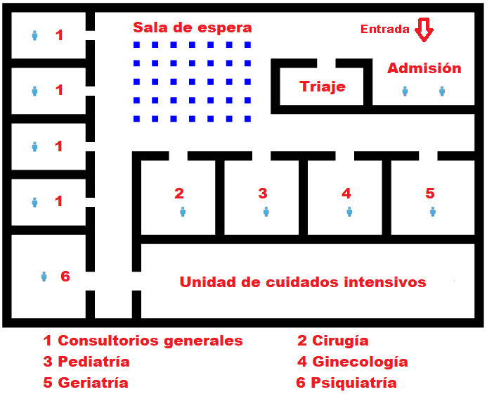

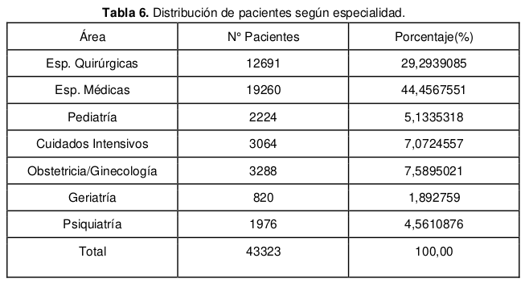

#### Triaje 

* Todos los pacientes pasan por esta sala, sin excepción
* Hay una cola de pacientes por orden de llegada a la admisión
* Las primeras 3 etapas tienen personal a cargo, la última se realiza mientras el paciente circula por el hospital
* Para el modelo de cada etapa se tiene un box que desencola a los pacientes y procesa las 3 etapas de manera serial, en vez de tener un
pipeline dividido
* Es por eso que se tienen 3 box para desencolar pacientes y así tener una performance similar a la de un pipeline

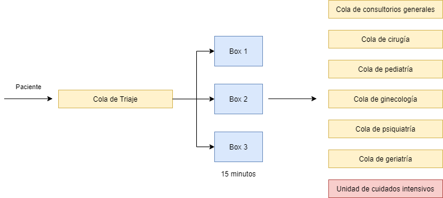

* Si bien el número es fijado en 3, se puede modificar para analizar que pasaría si hay más personal de atención
* Usando el criterio del peor caso, la atención en el triaje es de 15 minutos
* Una vez terminada la atención se tiene que saber la sala adonde tiene que ir el paciente, y el nivel de prioridad del mismo
* Se encola al paciente en la cola del área correspondiente, salvo que tenga que ir a la sala de cuidados intensivos, en este caso
va directamente sin ser encolado
* Se asigna el nivel de prioridad con el tiempo máximo de espera, y teniendo eso se encola cada paciente en su área
* Si hay dos pacientes con el mismo nivel de prioridad, se encola por orden de llegada

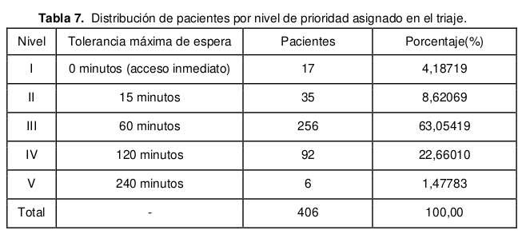

#### Unidad de cuidados intensivos

* Los casos en donde son atendidos en otra área y después se mandan a la UCI son considerados despreciables, ya que las atenciones mixtas
no se tienen en cuenta para esta simulación
* No se modeló ni se implementó el movimiento interno de los pacientes o del personal del hospital
* Los pacientes tienen que ir a la cama asignada y quedarse ahí hasta que termine el tiempo. En caso de que no haya camas disponibles, el paciente debe retirarse
y se contabiliza como un paciente rechazado por falta de recursos.
* Para determinar el tiempo de internación se usa la siguiente tabla:

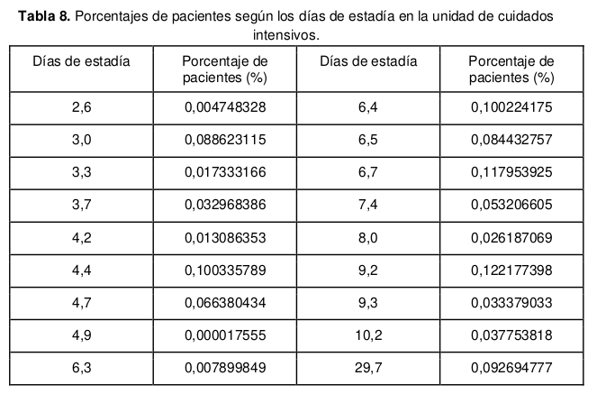

#### Sala de espera

* 35 sillas en la sala, con un metro entre ellas
* Si hay lugar, el paciente elige una silla y se sienta, sino, se contabiliza como paciente rechazado por falta de recursos
* La sala de espera es simple pero cumple un rol muy importante para el contagio entre pacientes

### Propagación de enfermedades

* Contagio directo e indirecto
* Para hacer las interacciones, se tiene que cada interacción dura 1 tick del sistema. Sabiendo que 1 tick equivale a un minuto, si se quiere
hacer una interacción de 15 minutos, se ejecutan 15 interacciones de 1 tick cada una
* La elección del tick del sistema influye en la precisión del modelo
* A partir de los 2 metros de distancia el contagio es despreciable 
* Dentro de los 2 metros de distancia, la probabilidad de infectarse será uniforme, es decir, que si uno esta a 40 cm o 1.8 m tiene
la misma probabilidad de infectarse
* El contagio por área y vectores no se tienen en cuenta para este modelo
* En el modelo hay objetos que pueden contaminarse y contagiar otros pacientes
* El contagio indirecto por objetos tiene la misma probabilidad de contagio que el directo, una vez que el paciente está en contacto con el objeto
* La probabildad de infección puede ser calibrada como un parámetro de entrada, pudiendo simular distintas enfermedades

#### Máquina de estados de salud de personas

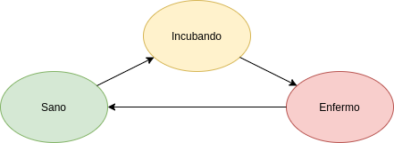

* Sano: Puede contraer la enfermedad pero no contagiar
* Incubando: No tiene síntomas pero puede contagiar a otras personas y objetos
* Enfermo: Puede ser tratado, y puede contagiar a personas y objetos

#### Máquina de estados de salud de objetos

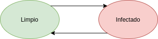

* Limpio: El objeto está infectado pero no puede contagiar a nadie
* Infectado: El objeto fue contaminado y tiene la capacidad de infectar a otras personas

#### Propagación de enfermedades en la UCI

* El contacto indirecto no sufre modificaciones, más que nada hay contacto indirecto entre pacientes y camas
* El cálculo del contagio directo dentro de la sala UCI se hace por estadística al no tener muchos datos. La chance de contagio es directamente proporcional
a la cantidad de pacientes infectados en la sala. Esto conlleva a que a medida que se vayan contagiando dentro de la sala, la probabilidad será cada vez mayor
* Se usa siempre el modelo original, a no ser que estes dentro de la UCI, donde se usa este modelo estadístico
* El modelo tendrá una entrada configurable que es la mortalidad de la enfermedad

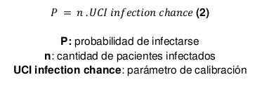

### Modelo basado en agentes

#### Agente paciente

* Puede moverse dentro de la sala UCI
* Puede interactuar con otros pacientes y objetos

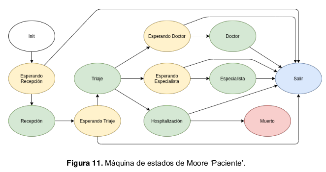

* Init: Estado en el que el paciente entra al hospital
* Recepción: Su atención dura 1 minuto hasta que puede pasar al triaje
* Triaje: Este estado dura 15 minutos y se determina el área a la que tiene que ir y su prioridad. Si va a la UCI no espera, va derecho
* Doctor: El paciente es atendido durante 15 min, luego va a la salida
* Especialista: El paciente es atendido durante 15 min, luego va a la salida
* Hospitalización: El paciente va derecho a la UCI en caso de que haya camas, sino va derecho a la salida. Dentro de la UCI el paciente
pasa el tiempo que diga la tabla de probabilidades y puede que muera, y pasa al estado muerto, o le den de alta y pase al estado salida
* Muerto: Se contabiliza la muerte y se elimina el agente
* Salida: El paciente sale de la sala donde esté hacia la salida, y una vez que la alcanza, se realiza la contabilización correspondiente y se lo elimina
* Esperando: En este estado el paciente se dirige a la sala de espera, ya sea que este esperando por un doctor, especialista o triage.
  * Esperando recepcionista: Ni bien llega el paciente debe anunciarse, por eso se encola y espera que el recepcionista lo llame
  * Esperando triaje: Espera a que un box lo llame para ser analizado y asignarle un área y prioridad
  * Esperando doctor: Espera a que un doctor lo solicite y pasar a estado doctor
  * Esperando especialista: Se encola en la cola del especialista específico al que fue asignado y espera para pasar al estado especialista

#### Personal interviniente en la atención

* Tienen la máquina de estado de salud
* El personal está vacunado y tiene una cierta probabilidad de estar inmunizado
* Para la atención de clientes usan el sistema cliente-servidor
* El personal desencola a los pacientes y los hace ir con el hasta que pase una cantidad de tick determinada, luego los libera

#### Agente recepcionista

* Tienen un sistema de cola única sin prioridades
* Se puede configurar la cantidad de recepcionistas pero por defecto es 1

#### Agente doctor

* Sistema de cola única con prioridades
* Se pueden elegir de 1 a 4 doctores

#### Agente especialista

* Cada agente tiene su propia cola individual con prioridades

#### Agente box

* Atiende a los pacientes en la etapa del triaje
* Utiliza el paradigma cliente servidor
* Utiliza una cola única sin prioridades
* No hay restricciones en la cantidad de boxes, pero por defecto son 3

#### Agente objeto

* Usan su propia máquina de estados
* Se manejan por contagio directo, no tienen un area de contagio
* La máquina de estados del objeto se comunica una vez por tick con la máquina de estados de la persona que este interactuando con el
* La probabilidad de infección del objeto es la misma que la de una persona
* Puede volver al estado limpio, gracias al personal de limpieza

#### Agente silla

* Su particularidad es que tiene una posición fija en la sala de espera
* Usa el modelo de objeto

#### Agente cama

* No tienen representación física
* Interactuan directamente con el paciente que les fue asignado
* Se puede configurar la cantidad de camas con un parámetro, pero se suele usar la ecuacion 1 para buscar una buena cantidad

#### Agente personal de limpieza

* No tienen representacion física, pero limpian de manera periódica los objetos
* El tiempo para que lo limpien es configurable
* Se puede elegir entre 1 hora y 24, por defecto se eligen 24 hs

#### Ingreso de pacientes

* Se toman valores de cantidad de pacientes por día y cantidad de infectados por día durante los 365 dias del año
* Se usa la ecuación RATE'' para saber cuantos pacientes entran en un día determinado

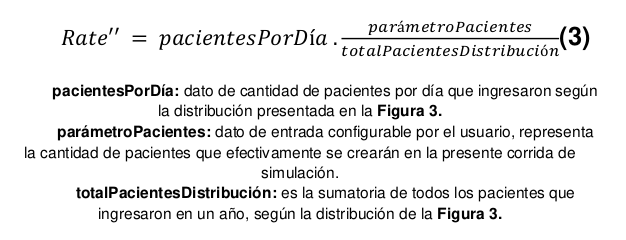

* Se usa la ecuación RATE para saber cuantos pacientes entran en un período de 2 horas
* Rate se va actualizando cada 2 horas de ejecución

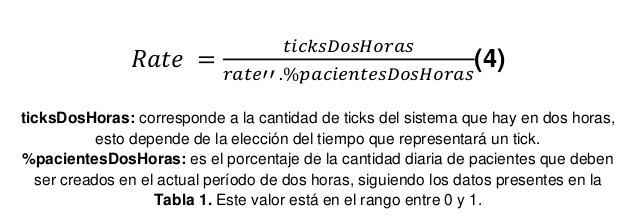

* La tasa de ingreso de pacientes con la enfermedad se calcula con otra ecuación

## Parámetros de entrada

* Importante tenerlos en cuenta y verlos a todos

